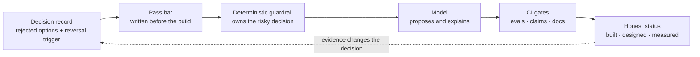

<h1>Ossama Mokhtar</h1>

<strong>AI-Native Product Builder · Founder &amp; Principal, BubblesUPs</strong> 
Dubai, UAE: building for GCC, EU and US markets

<em>I decide what an AI product should do, then build it far enough to prove the decision holds: 
the decision record, the deterministic guardrail, the eval that fails the build, and the cost per outcome.</em>

[LinkedIn](https://www.linkedin.com/in/ossama-mokhtar/) · [X](https://x.com/OsamaElMokhtar) · ossamaelmokhtar@outlook.com

---

## What "AI-native" means in my work

It doesn't mean "uses an LLM". It means the product is designed around what models are bad at, and the proof is in the repo, not the pitch.

| Capability | How it shows up | Evidence |
|---|---|---|
| **The model proposes; the system decides** | LLM output is a structured proposal. A deterministic engine owns the decision, and a bounds checker gates it before anyone sees it | [PolySync bounds checker](https://github.com/OssamaMokhtar/PolySync/blob/main/app/src/engine/boundsChecker.ts) · [RLens ADR-001](https://github.com/OssamaMokhtar/RLens/blob/main/docs/13-decision-log.md) |
| **Evals are release gates** | Pass bars are written before the feature. CI fails on a single critical miss, never on over-caution | [PolySync eval results](https://github.com/OssamaMokhtar/PolySync/blob/main/evals/results/latest.json) · [Youna crisis golden set](https://github.com/OssamaMokhtar/youna/blob/main/src/lib/__tests__/safety.test.ts) |
| **Safety paths never touch the model** | When crisis language is detected, the reply is fixed text plus resources. The model is not asked | [Youna safety module](https://github.com/OssamaMokhtar/youna/blob/main/src/lib/safety.ts) |
| **Unit economics live in the code** | Cost logged per scored utterance; a daily AI budget that fails closed; per-device rate limits, because carrier-grade NAT puts many GCC mobile users behind one IP | [Fluvio cost meter](https://github.com/OssamaMokhtar/Fluvio/blob/main/services/costMeter.ts) · [PolyVerses API guards](https://github.com/OssamaMokhtar/PolyVerses/blob/main/server/guard.ts) |
| **Claims as code** | Every documented claim is an executable check. If a doc drifts from the code, CI fails and names both | [Fluvio claims verifier (19 claims)](https://github.com/OssamaMokhtar/Fluvio/blob/main/scripts/verify-claims.mjs) · [PLOS library validator](https://github.com/OssamaMokhtar/product-leadership-os/blob/main/scripts/validate.mjs) |
| **Agent systems** | 189 ranked agent skills with a validated dependency graph; a staged multi-agent workflow with human approval gates | [PLOS agent integration](https://github.com/OssamaMokhtar/product-leadership-os/blob/main/docs/04-agent-integration.md) · [PolyVerses agent architecture](https://github.com/OssamaMokhtar/PolyVerses/blob/main/docs/04-agent-architecture.md) |
| **Compliance by design** | Emotion inference removed under EU AI Act Art. 5(1)(f), with a test that blocks its return. Fairness pass bars set before any credit model exists | [Hirena compliance](https://github.com/OssamaMokhtar/Hirena/blob/main/docs/08-security-and-compliance.md) · [RLens fairness plan](https://github.com/OssamaMokhtar/RLens/blob/main/docs/14-evaluation-and-fairness.md) |
| **Bilingual by construction** | Arabic and English with structural RTL in the running UI, and a design where adverse-action reasons come from one reason code in both languages | [RLens bilingual tone pack](https://github.com/OssamaMokhtar/RLens/blob/main/docs/10-bilingual-tone-pack.md) · [RLens ADR-005](https://github.com/OssamaMokhtar/RLens/blob/main/docs/13-decision-log.md#adr-005-bilingual-by-construction) |

## How I build

---

## Flagship

### [PolySync](https://github.com/OssamaMokhtar/PolySync): AI coaching for hybrid athletes, where the model cannot prescribe

Endurance and strength training interfere with each other. Most apps run two plans in parallel and leave the athlete to absorb the collision. In PolySync a **deterministic engine owns every load prescription**. The LLM explains and *proposes* changes, and each proposal must clear a bounds checker before it reaches an athlete. Anything blocked goes to a human coach.

- **Measured on every push:** 0 contraindicated exercises in 8,640 generated plans; 2,067 of 2,067 unsafe proposals blocked and escalated; 194 of 194 safe substitutions accepted.
- **Not yet measured:** model proposal quality, coach minutes per athlete, real users. The rules are v0 and not yet coach-signed.

[Architecture docs](https://github.com/OssamaMokhtar/PolySync/blob/main/docs/README.md) · [Decision log](https://github.com/OssamaMokhtar/PolySync/blob/main/docs/10-decision-log.md) · [Eval harness](https://github.com/OssamaMokhtar/PolySync/blob/main/evals/run.ts) · [Gaps](https://github.com/OssamaMokhtar/PolySync/blob/main/docs/GAPS.md)

---

## Portfolio

Every repo carries the same architecture doc set: status, system architecture, data model, API, AI architecture, evaluation, security, decision log (ADRs with rejected options and reversal triggers) and ranked gaps. It also has a CI gate that checks the docs themselves: links resolve, diagrams close, every doc states its status. **None of these products has users yet, and each one says so.**

| Project | What it is | AI-native pattern it proves | Status | Architecture docs |
|---|---|---|---|---|
| **[PolySync](https://github.com/OssamaMokhtar/PolySync)** | AI coaching for hybrid athletes, coach in the loop | Model proposes, engine decides; safety evals gate every push | Prototype; safety layer measured | [Docs](https://github.com/OssamaMokhtar/PolySync/blob/main/docs/README.md) · [ADRs](https://github.com/OssamaMokhtar/PolySync/blob/main/docs/10-decision-log.md) · [Gaps](https://github.com/OssamaMokhtar/PolySync/blob/main/docs/GAPS.md) |
| **[Fluvio](https://github.com/OssamaMokhtar/Fluvio)** | Pronunciation and fluency coach (Whisper → GPT-4o), 13 practice languages | Cost per utterance, spend ceiling, claims verifier | Deployed on Vercel. Scores are model judgements, not acoustic measurement, and the product says so | [Docs](https://github.com/OssamaMokhtar/Fluvio/blob/main/docs/README.md) · [ADRs](https://github.com/OssamaMokhtar/Fluvio/blob/main/docs/10-decision-log.md) · [Gaps](https://github.com/OssamaMokhtar/Fluvio/blob/main/docs/GAPS.md) |
| **[Youna](https://github.com/OssamaMokhtar/youna)** | AI wellness companion: check-ins, mood, journaling. Not a therapist | Deterministic crisis path, golden set in CI, multi-provider fallback | Pre-release | [Docs](https://github.com/OssamaMokhtar/youna/blob/main/docs/README.md) · [ADRs](https://github.com/OssamaMokhtar/youna/blob/main/docs/10-decision-log.md) · [Gaps](https://github.com/OssamaMokhtar/youna/blob/main/docs/GAPS.md) |
| **[Hirena](https://github.com/OssamaMokhtar/Hirena)** | Skills self-assessment and gap analysis for PMs, MENA-first | Deterministic role-weighted scoring, where the LLM only proposes levels; labelled fallback; compliance by design | Prototype, text only | [Docs](https://github.com/OssamaMokhtar/Hirena/blob/main/docs/README.md) · [ADRs](https://github.com/OssamaMokhtar/Hirena/blob/main/docs/10-decision-log.md) · [Gaps](https://github.com/OssamaMokhtar/Hirena/blob/main/docs/GAPS.md) |
| **[PolyVerses](https://github.com/OssamaMokhtar/PolyVerses)** | Agent workbench: staged PM workflow with human approval gates | Multi-agent orchestration, server-side keys, API guards, simulated surfaces labelled | Prototype; agent output quality not yet evaluated | [Docs](https://github.com/OssamaMokhtar/PolyVerses/blob/main/docs/README.md) · [ADRs](https://github.com/OssamaMokhtar/PolyVerses/blob/main/docs/10-decision-log.md) · [Gaps](https://github.com/OssamaMokhtar/PolyVerses/blob/main/docs/GAPS.md) |
| **[Product Leadership OS](https://github.com/OssamaMokhtar/product-leadership-os)** | 189 ranked, deduplicated agent skills (Claude Code) and an Obsidian graph | A skill system run as a product: dedup, dependency graph, supply-chain rules in CI | Library validated in CI; decision outcomes not yet measured | [Docs](https://github.com/OssamaMokhtar/product-leadership-os/blob/main/docs/README.md) · [ADRs](https://github.com/OssamaMokhtar/product-leadership-os/blob/main/docs/10-decision-log.md) · [Gaps](https://github.com/OssamaMokhtar/product-leadership-os/blob/main/docs/GAPS.md) |
| **[RLens](https://github.com/OssamaMokhtar/RLens)** | Explainable alternative-data credit scoring for GCC thin-file borrowers, AR/EN | The LLM explains and never decides; fairness bars set before any model | Reference architecture (15 docs) plus AR/EN UI on sample data. No trained models | [Docs](https://github.com/OssamaMokhtar/RLens/blob/main/docs/README.md) · [ADRs](https://github.com/OssamaMokhtar/RLens/blob/main/docs/13-decision-log.md) · [Gaps](https://github.com/OssamaMokhtar/RLens/blob/main/docs/GAPS.md) |

### Measured today

Every number below is produced by CI on each push and can be reproduced from the repo.

| Project | What is measured | Result |
|---|---|---|
| PolySync | Contraindicated exercises in generated plans | **0 of 8,640** |
| PolySync | Unsafe proposals blocked and escalated to a coach | **2,067 of 2,067** |
| PolySync | Safe substitutions accepted | **194 of 194** |
| PolySync | Rule table agreement with hand labels (AI-assisted, not yet coach-reviewed) | 49 of 49 |
| Youna | Crisis phrases detected · everyday phrases wrongly flagged | 20 of 20 · 0 of 9 |
| Fluvio | Documented claims verified against source | 19 of 19 |
| Product Leadership OS | Skills valid · dependency links resolving | 189 · 222 of 222 |

**Not measured anywhere yet:** model output quality, real users and retention. Each repo's evaluation doc states the test that would measure these and the bar it has to clear.

---

## How I work

**Unit economics before features.** An AI feature whose inference cost scales with engagement has inverted SaaS margins. That belongs in the spec, not the post-mortem.

**Evals are the quality bar, not a demo.** If you can't say what "good" means and measure it on every change, you have a prompt that worked once. Fail the build on one missed critical case, never on over-caution. The asymmetry is the design.

**The model proposes; the system disposes.** Where being wrong hurts (training load, mental health, credit), the model never has the final write.

**Bilingual by construction.** In the GCC, Arabic/English is a structural constraint, not a localisation ticket.

**The trade-off is the decision.** Every ADR names what was rejected and what evidence would reverse it. A roadmap without a stated non-goal is a wish list.

---

## Client and employer outcomes

These come from engagements I led as a consultant at BubblesUPs (since 2022) and in earlier roles. They are **not** from the portfolio prototypes above. Engagement details are available on request.

| Outcome | Context |
|---|---|
| **$1.5M ARR** | AI-native product portfolio, multi-market |
| **+30% YoY revenue** | B2B/B2C commerce suite, 3 markets in 6 months |
| **22% → 34%** | Repeat purchase rate on that suite |
| **−45% design-to-code** | AI-assisted engineering workflow |
| **78% beta retention** | LLM knowledge system; relevancy +25%, ROUGE > 0.65 |
| **NPS 66 → 78** | CarTrawler |
| **+67% retention · +44% acquisition** | MoneyBekia, customer-centric redesign |

Earlier: Performance Manager at Vodafone, leading a 30-person cross-functional team; credit analyst at CIB.

---

## Working in the open

Every repo runs CI on each push and pull request, and no step is allowed to pass on failure. Where a project makes a safety or honesty claim, CI checks that claim too.

In September 2026 I audited my own portfolio against the standard I'd hold a team to. It found:

- builds that were red on `main`;
- CI steps that could never fail;
- docs that described controls the code didn't have. For example, Fluvio documented per-device rate limiting that the client never sent, and one PolyVerses model endpoint was anonymous and unlimited.

Each fix ships with a check that stops it from coming back. The history is in each repo.

---

## Stack

**AI systems:** LLM APIs (Claude, GPT-4o, Gemini, Whisper) · evals and golden sets · RAG · multi-model fallbacks · agent orchestration · Claude Code skills · deterministic guardrails · cost telemetry
**Build:** TypeScript · React · Next.js · Node.js/Express · Python · PostgreSQL · Firestore · Prisma
**Cloud:** Vercel · GCP/Firebase · AWS
**Product:** ADRs with reversal triggers · RICE · unit economics · experiment design · EU AI Act and GCC regulatory mapping

---

## Currently

Founder & Principal at **BubblesUPs**. MBA at **Gies College of Business, University of Illinois Urbana-Champaign** (expected Nov 2026).

**Open to** Principal PM, Group PM, Director and Head of Product roles in AI products, in the GCC, EU, US or remote. Also advisory.
